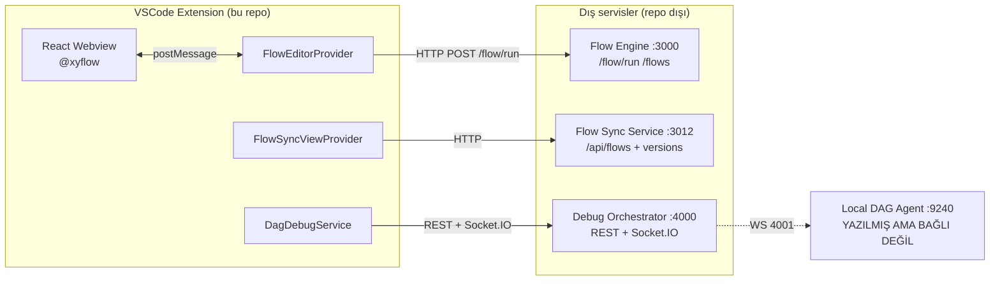

# reactdnd — Extension Mimari Analizi

> Kapsam: `src/` (extension host) + `webview-src/` (React/@xyflow). Amaç: mevcut mimarinin doğrularını/yanlışlarını tespit etmek, UX açısından değerlendirmek ve dört açık mimari soruya (node execution modeli, dosya/versiyon yönetimi, engine node registry, sub-flow çağırma) somut öneri getirmek.

## 1. Sistemin şu anki hali (özet)

Bu bir **VSCode Custom Editor uzantısı**. Kendisi bir flow *runtime* değil, bir flow **authoring + debug istemcisi**. Gerçek çalıştırma dışarıdaki bağımsız servislere devrediliyor:

| Bileşen | Nerede yaşıyor | Rolü |
|---|---|---|
| Flow/WebForm editör UI | Bu repo (`webview-src`) | Yazma/düzenleme |
| Flow dosyaları (`.flow`, JSON) | Kullanıcının workspace'i | Kaynak of truth (yerel dosya) |
| **Flow Engine** | Dışarıda, `localhost:3000` | `/flow/run`, `/flows` — asıl çalıştırma |
| **Flow Sync servisi** | Dışarıda, `localhost:3012` | `/api/flows`, versiyon geçmişi, rollback |
| **Debug Orchestrator** | Dışarıda, `localhost:4000` | Breakpoint/step kontrol düzlemi |
| **Local DAG Agent** | Bu repo içinde tanımlı ama **hiç instantiate edilmiyor**, `127.0.0.1:9240` | Runtime ile orchestrator arasında köprü (yazılmış, bağlı değil) |

Üç ayrı dışarıdaki servise (`3000`, `3012`, `4000`) sabit `localhost` URL'leriyle bağımlılık var; bunların hiçbiri bu repo'da değil — yani bu extension'ın "doğruluğu" büyük ölçüde görünmeyen bir dış sistemin varlığına bağlı.



---

## 2. Doğrular — iyi kararlar

1. **Editör/runtime ayrımı net.** Extension dosya formatını ve UX'i yönetiyor, execution'ı dışarı devrediyor. Bu doğru bir sınır — VSCode extension'ı bir runtime'a dönüştürmek (uzun süren flow'ları extension host'ta çalıştırmak) hem performans hem lifecycle açısından yanlış olurdu.
2. **`.flow` dosyaları düz JSON, workspace'te.** Diff'lenebilir, code review edilebilir, git ile doğal olarak versiyonlanabilir. XML/binary bir format seçilmemiş olması iyi.
3. **DAG debug protokolü, node-boundary semantiğine göre tasarlanmış** (`.github/dag-flow-debugger-orchestration-instruction.md`), line-based debug'ı kopyalamaya çalışmamış. `flowId+nodeId` breakpoint identity'si, Step Into/Over/Out'un composite-node semantiği doğru bir soyutlama.
4. **HTTP call'lar extension host üzerinden proxy'leniyor** (`executeHttpCall`), webview'da değil. Webview'ın CSP'si (`connect-src` whitelist) zaten dar tutulmuş; keyfi URL'lere webview'dan fetch atmak yerine Node.js tarafında yapılması hem CSP hem CORS hem de token güvenliği (`.openapi-auth.json`) açısından doğru.
5. **Kayıtlı node tipleri sabit bir palet.** `NodeLibraryViewProvider` + `webview-src/nodes/*` üzerinden node tipleri kodda tanımlı — bu, "her şey mümkün" kaos'unu önlüyor, node editörü kapalı bir tip sistemi üzerine kurulu.
6. **README dürüst.** "Bilinen boşluklar" bölümü gerçek durumu saklamıyor — bu nadir ve değerli bir sinyal, teknik borcu gizlemek yerine işaretliyor.

## 3. Yanlışlar / riskler

| # | Sorun | Ciddiyet | Neden |
|---|---|---|---|
| R1 | **Versiyon senkronizasyonu kırılgan.** `isPendingSync` önce `local v > remote v` karşılaştırıyor, yoksa `mtime > createdAt` fallback'ine düşüyor (clock skew toleransı sadece 1 saniye). Çoklu makine / farklı saat dilimi / senkronize olmayan sistem saati senaryosunda yanlış "synced" durumu gösterebilir. | Yüksek | `src/FlowSyncViewProvider.ts:422-451` |
| R2 | **`version` alanı flow JSON'un içinde, ama artımı client-side.** `bumpFlowVersionAndSave` yerel dosyadaki `version`'ı +1 yapıyor; sunucudaki gerçek versiyon numarasıyla hiçbir garantili ilişkisi yok (iki kullanıcı aynı anda kayıt ederse çakışma sessizce üstüne yazılır — optimistic locking yok). | Yüksek | `FlowEditorProvider.ts:514-526` |
| R3 | **Git ve "Flow Sync servisi" aynı anda, koordinasyonsuz iki versiyon kaynağı.** Dosya repo'da git'e de commit'lenebilir, aynı zamanda ayrı bir REST servisine de push edilir. İki sistem birbirinden habersiz — git tarihi ile "flow sync" versiyon geçmişi diverge edebilir, hangisi "doğru" belli değil. | Yüksek | Mimari |
| R4 | **DAG Debug için hiçbir UI tetikleyici yok** (README'de de kabul ediliyor). `DagDebugContext.sendCommand()` hiçbir yerden çağrılmıyor — protokol tam yazılmış ama kullanıcı erişemiyor. Ölü kod riski: bakım maliyeti üretiyor, değer üretmiyor. | Orta-Yüksek | `webview-src/context/DagDebugContext` |
| R5 | **`LocalDagDebugAgent` hiç instantiate edilmiyor.** Spec'in merkezi bileşeni (port 9240) tamamen yazılmış ama `new LocalDagDebugAgent(...)` hiçbir yerde çağrılmıyor — yani debug mimarisinin runtime tarafı fiilen çalışmıyor. | Yüksek | `src/LocalDagDebugAgent.ts` |
| R6 | **Node tipi/versiyon kontratı yok.** Editör (webview'daki React component'ler) ile Flow Engine'in aynı node semantiğini paylaştığına dair hiçbir mekanizma yok — ne bir şema versiyonu, ne bir capability-negotiation, ne bir "engine bu node tipini/versiyonunu destekliyor mu" kontrolü. Editörde yeni bir node tipi eklenip engine güncellenmeden deploy edilirse flow sessizce hatalı çalışır ya da 404/`undefined` handler alır. | Yüksek | Mimari boşluk |
| R7 | **Sub-flow çağırma (`CallNode`) referans bütünlüğü kontrol edilmiyor.** Çağrılan flow `GET /flows`'tan seçiliyor ama seçilen referans (isim/id) engine tarafında var olmaya devam edecek mi, versiyon kilitlenmiş mi (pinned) yoksa her zaman "latest" mi çalışacak — belirsiz. Bu "hangi versiyon çalışacak" sorusunu doğrudan üretir. | Orta | `webview-src/nodes/CallNode.tsx` |
| R8 | **Auth token'lar düz JSON dosyasında, plaintext.** `.openapi-auth.json` içine bearer token yazılıyor (`writeAuthToken`). VSCode `SecretStorage` API'si varken bunu kullanmamak — workspace'i git'e commit eden/paylaşan kullanıcı için token sızıntısı riski. | Yüksek (güvenlik) | `FlowEditorProvider.ts:581-590` |
| R9 | **Ölü/yarım kod parçaları birikmiş.** `PipeletExplorerViewProvider.ts` register edilmiyor, `LocalDagDebugAgent` bağlı değil, DAG debug UI'sız. Bu, "bilinen boşluklar" olarak dürüstçe not edilmiş olsa da, üç ayrı yarım-özellik aynı anda repo'da yaşıyor — bakım yükü ve okunabilirlik maliyeti birikiyor. | Orta | Genel |
| R10 | **`fetchFlowsFromEngine`/`executeHttpCall` hardcoded `localhost:3000`.** `dagDebug.*` ayarları `package.json > contributes.configuration` içinde var ama flow engine URL'i `handleStartFlow` içinde sabit kodlanmış (`hostname: 'localhost', port: 3000`), `dagDebug.flowEngineUrl` ayarı **tanımlı ama kullanılmıyor** gibi görünüyor. Config tutarsızlığı. | Orta | `FlowEditorProvider.ts:376-446` |

### 3.1 Giderilme durumu (2026-08-11)

Aşağıdaki bulgular `worktree-extension-findings-remediation` dalında giderildi
(12 commit, plan: `docs/superpowers/plans/2026-08-11-extension-findings-remediation.md`).
Bu bölüm durumu özetler; yukarıdaki R1–R10 tablosu bulguların **tespit anındaki**
kaydı olarak olduğu gibi bırakılmıştır.

| # | Durum | Ne yapıldı |
|---|---|---|
| R1 | ⚠️ Kısmen | `baseVersion` alanı eklendiği için artık semantik karşılaştırma birincil yol; `mtime` fallback'i hâlâ duruyor. Tam çözüm sunucu tarafı gerektiriyor. |
| R2 | ✅ Giderildi | `POST /api/flows` artık `baseVersion` gönderiyor; HTTP 409'da "Overwrite remote / Pull latest" conflict diyaloğu çıkıyor. **Not:** koruma ancak sunucu `baseVersion`'ı zorlarsa etkin — sunucu alanı yok sayarsa eski davranışa düşer (regresyon yok). |
| R3 | ⚠️ Kısmen | Sync `source` alanı artık `<kaynak>@<12-karakter-git-sha>` şeklinde etiketleniyor, yani sunucudaki her versiyon bir git commit'ine izlenebiliyor. Git'i tek otorite yapan tam "deploy pointer" modeli (§5.2) hâlâ açık. |
| R4 | ✅ Giderildi | Canvas'a Continue/Pause/Step Over/Step Into/Step Out/Stop/Restart toolbar'ı eklendi; `sendCommand()` artık gerçekten çağrılıyor. `debugMode`/`isPaused` context'ten expose edildi. |
| R5 | ✅ Giderildi | `LocalDagDebugAgent` artık instantiate ediliyor ve port 9240'ta dinliyor; breakpoint map'i `DagDebugService` ile üç mutasyon noktasında da senkron tutuluyor. `start()` await edilmiyor ve reddi yakalanıyor — orchestrator yoksa aktivasyon kırılmıyor. |
| R6 | ❌ Açık | Node Type Registry (§5.3) — dış Flow Engine'de kontrat değişikliği gerektirdiği için bu repodan yapılamaz. |
| R7 | ❌ Açık | Sub-flow `flowId+version` referansı (§5.4) — aynı sebeple açık. |
| R8 | ✅ Giderildi | Token'lar `.openapi-auth.json`'dan VSCode `SecretStorage`'a taşındı; ilk okumada eski dosya migrate edilip siliniyor (önce yaz, sonra sil — yazma başarısızsa dosya korunuyor). Silme başarısız olursa kullanıcı uyarılıyor. `OpenApiExplorerProvider` de artık SecretStorage okuyor. |
| R9 | ✅ Giderildi | `PipeletExplorerViewProvider.ts` silindi; `DagDebugService.postFlowRun` (çağrılmayan, hardcoded URL'li ölü metot) silindi. R4/R5 ile diğer iki yarım özellik de tamamlandı. |
| R10 | ✅ Giderildi | `handleStartFlow`/`fetchFlowsFromEngine` artık `dagDebug.flowEngineUrl` okuyor (varsayılan `package.json`'daki ile birebir aynı, davranış değişmiyor). Her iki metot `async` yapıldı ki hatalı URL ayarı `.catch()`'e ulaşsın. |

**Hâlâ elle doğrulanması gerekenler** (VSCode Extension Development Host, F5 —
otomatik test altyapısı olmadığı için bu repodan doğrulanamaz):

1. **Önce bunu kontrol edin:** `bumpFlowVersionAndSave` her kayıtta yerel
   `version`'ı artırıyor ve `buildPayload` bu artmış değeri `baseVersion` olarak
   gönderiyor. Yani "v3 çek → düzenle → kaydet (yerel v4) → sync" akışında
   sunucuya `baseVersion: 4` giderken sunucunun son sürümü 3. Sunucunun bunu
   "stale" sayıp saymadığı onun karşılaştırma mantığına bağlı — sayarsa **her
   rutin sync conflict diyaloğu açar**. Gerçek servise karşı doğrulanmalı.
2. SecretStorage round-trip: token kaydet → pencereyi reload et → hâlâ duruyor mu,
   `.openapi-auth.json` silinmiş mi, OpenAPI Explorer'ın kilit ikonu doğru mu.
3. Port 9240: ikinci bir VSCode penceresi açıp EADDRINUSE durumunun kabul
   edilebilir şekilde bozulduğunu ve reload'da portun serbest kaldığını doğrula.
4. Canlı orchestrator/flow engine ile tam debug turu: `BREAKPOINT_HIT` webview'a
   ulaşıyor mu, Continue gerçekten devam ettiriyor mu.
5. `flowEngineUrl` varsayılan olmayan bir host'a çevrildiğinde: host tarafı HTTP
   takip eder ama webview'ın WS'i hâlâ `localhost:3000`'de kalır (CSP
   `FlowEditorProvider.ts` + `FlowRuntimeContext.tsx`) — ayar üçte iki oranında
   uygulanıyor, bu bilinen bir sınır.

**Ertelenen küçük bulgular:** bulk sync'te dosya başına git subprocess;
`writeAuthToken` read-modify-write yarışı; oturum öncesi STOP/RESTART
gönderilebilmesi (host zaten uyarıyla reddediyor); rollback POST'unun SHA
etiketlenmemesi; multi-root workspace'te ilk klasörün SHA'sının kullanılması;
`OpenApiExplorerProvider`'da artık atanmayan `authWatcher` alanı.

## 4. UX analizi

**Güçlü noktalar:**
- Sürükle-bırak + grid snap (150×200, dot-grid) net bir tasarım kararı; "free drag, magnetic drop" akıcı bir his verir.
- Cartridge/Pipelet/OpenAPI/Flow-Sync için ayrı tree view'lar workspace keşfini organize ediyor — kullanıcı büyük bir cartridge ağacında kaybolmuyor.
- Node detail panel + node library ayrı sidebar'larda — düzenleme ve palet birbirine karışmıyor.

**Sürtünme noktaları:**
- **Sync durumu belirsiz geri bildirim veriyor.** "local v3 • remote v2 • not synced" gibi bir etiket teknik olarak doğru ama kullanıcıya *ne olacağını* söylemiyor: sync edersem remote v2 mi kaybolacak, yoksa v3 mü yeni versiyon olacak? Conflict senaryosu (biri push etmiş, ben de değiştirmişim) için hiçbir uyarı/diff UI'ı yok — direkt üstüne yazılıyor.
- **DAG Debug butonu var ama arkasında hiçbir şey çalışmıyor** (bkz. R4/R5) — kullanıcı "Start With Debug"a tıklayıp sessiz bir başarısızlıkla ya da hiçbir şey olmamasıyla karşılaşabilir; bu güveni kırar.
- **Flow engine bağlantısı yoksa sessiz/generic hata.** `handleStartFlow`, engine `:3000`'e erişilemezse kullanıcıya "Error: connect ECONNREFUSED" gibi ham bir mesaj gösterir (`showInformationMessage`) — actionable değil ("engine çalışıyor mu kontrol et" gibi bir yönlendirme yok).
- **Rollback UX'i tek onay diyaloğu ile geri dönüşü olmayan bir aksiyon.** "Rollback creates a new version" mesajı doğru ama rollback öncesi *diff önizlemesi* yok — kullanıcı hangi node'ların değişeceğini görmeden onaylıyor.
- **Sub-flow seçimi (`CallNode`) sadece isim listesi.** Hangi versiyonun çağrılacağı, input/output kontratının ne olduğu editör içinde görünmüyor — kullanıcı flow'u çalıştırana kadar öğrenemiyor.

---

## 5. Açık mimari sorular — analiz ve öneri

### 5.1 Flow node'ları çalıştırılırken API mi, FaaS mi kullanılmalı?

**Mevcut durum:** Tek bir "Flow Engine" servisi (`:3000`), tüm flow'u `POST /flow/run` ile bütün olarak alıyor ve muhtemelen kendi içinde interpret ediyor (monolitik yorumlayıcı). Node tipine göre farklı bir execution stratejisi yok gibi görünüyor.

**Değerlendirme:**

| Yaklaşım | Ne zaman doğru | Bu proje için risk |
|---|---|---|
| **Uzun-ömürlü API servisi (mevcut)** | Node'lar hafif, düşük gecikmeli, sık çağrılıyor (DB sorgusu, basit transform, HTTP proxy) | Cold-start yok, state paylaşımı kolay, ama **tüm node tipleri için tek deployment birimi** — bir pipelet'in hatası tüm engine'i etkileyebilir; ölçeklenme node bazında değil servis bazında olur |
| **FaaS (her node/pipelet ayrı fonksiyon)** | Node'lar birbirinden bağımsız, seyrek/patlamalı (bursty) çağrılıyor, farklı runtime/dil gerektirebiliyor (ör. `.pipelet` dosyaları görünüşe göre kendi DSL'i + handler script'i olan bağımsız birimler) | Cold-start gecikmesi DAG debug deneyimini (adım adım ilerleme) yavaşlatır; distributed tracing/step debug karmaşıklaşır (bkz. mevcut orchestrator zaten bunun zorluğunu çözmeye çalışıyor) |

**Öneri — hibrit, node tipine göre ayrıştırılmış model:**

- **Kontrol düzlemi (flow orchestration = sıradaki node'u belirleme, breakpoint, değişken taşıma) tek bir uzun-ömürlü "Flow Engine" API'sinde kalmalı.** Bu zaten mevcut `:3000` servisinin doğal işi ve DAG debug orchestrator'ın (`:4000`) beklediği model budur — step semantiği (Step Into/Over/Out) sürekli çalışan bir process olmadan tutarlı tutulamaz.
- **Node'un *iş mantığı* (pipelet handler'ı, script node, function node) çağrılırken iki kategori ayrılmalı:**
  - *Senkron, düşük gecikmeli, sık kullanılan node'lar* (DecisionNode, basit transform/ProcessNode) → engine process'i içinde in-process çalıştırılmaya devam etsin.
  - *Bağımsız, izole, potansiyel olarak farklı dilde/runtime'da olan node'lar* (`.pipelet` dosyaları, `MethodCallNode`'un çağırdığı dış entegrasyonlar, `ScriptNode`) → FaaS/worker havuzuna (ör. AWS Lambda, kendi barındırılan bir "pipelet runner" worker seti) devredilebilir; ama bu **engine'in kontrolünde**, engine invoke eder, sonucu bekler, debug event'i yine tek noktadan (engine) orchestrator'a raporlanır.
- Yani "API mi FaaS mi" ikilemi yanlış soru — doğru soru **"kontrol düzlemi mi, execution düzlemi mi"**. Kontrol düzlemi tek API olarak kalmalı (debug/step tutarlılığı için zorunlu); execution düzlemi node tipine göre karma olabilir. Bunu şimdi zorlamaya gerek yok — mevcut monolitik engine MVP için doğru, ama pipelet sayısı/çeşitliliği arttıkça (bugün repo'da 80+ pipelet örneği var) bu ayrım kaçınılmaz olacak.

### 5.2 Dosya kayıt mekanizması: git mi, ayrı bir servis mi, versiyon kontrolü nasıl olmalı?

**Mevcut durum (R1-R3'te detaylandı):** İki paralel, koordinasyonsuz versiyon kaynağı var — workspace'teki dosya (git'e girebilir) + `:3012`'deki "Flow Sync" servisinin kendi versiyon geçmişi. Hangisi otorite belirsiz.

**Öneri:**

1. **Git'i "kaynak of truth" yap, Flow Sync servisini git'in üzerine bir *yayın/deploy katmanı* olarak konumlandır** — ikisini eşdeğer iki versiyon sistemi gibi değil, biri diğerinin üzerine kurulu tek yönlü bir akış gibi tasarla:
   ```
   Local edit → git commit (asıl versiyon geçmişi, blame, diff, branch/PR review)
        → "Publish/Deploy" aksiyonu → Flow Sync servisi (çalışma zamanı için "aktif versiyon" pointer'ı tutar)
   ```
   Flow Sync servisinin kendi "version: 1,2,3..." sayacı tutması gereksiz bir ikinci kaynak yaratıyor; bunun yerine **git commit SHA'sını** version identity olarak taşısın (`source: "editor-file-sync"` yerine `source: <git-sha>`). Rollback = engine'e "şu SHA'daki içeriği aktif yap" demek, git history'de kaybolmaz.
2. **Neden git tek başına yetmiyor:** Çalışma zamanındaki engine'in "şu an hangi versiyon aktif/deployed" bilgisine ihtiyacı var, ve bu git branch/working-tree state'inden bağımsız olmalı (kullanıcı local'de deneme değişikliği yapabilir ama engine'de prod versiyonu çalışmaya devam etmeli). Bu yüzden ayrı bir "aktif versiyon" kaydı (mevcut Flow Sync servisi) haklı — ama bunun **git'in yerini almaması**, git'in üstüne ince bir "deploy pointer" katmanı olması gerekiyor.
3. **Optimistic locking ekle (R2 için):** `POST /api/flows` çağrısı client'ın gördüğü son remote versiyonu (`baseVersion`) da göndermeli; sunucu `baseVersion !== currentVersion` ise 409 dönmeli, extension conflict UI'ı göstermeli (git'teki gibi "remote değişmiş, merge/overwrite/cancel" seçeneği).
4. **`version` alanını flow JSON içine yazmayı bırak** — bu, dosyanın kendisini versiyon-farkında yapıyor ve git diff'lerini kirletiyor (her save'de `version` + `updatedAt` değişiyor, asıl içerik değişmese bile). Versiyon bilgisi sunucu tarafında (Flow Sync servisi + git SHA eşlemesi) tutulmalı, dosyanın içinde değil.

### 5.3 Flow, kayıtlı node'lardan ilerlemeli — engine önceden bunları bilmeli mi, versiyonlu olmalı mı?

**Mevcut durum:** Node tipleri hem `webview-src/nodes/*.tsx` (görsel/editör tanımı) hem de engine'in bir yerinde (repo dışı, görünmüyor) implicit olarak tanımlı. İkisi arasında hiçbir kontrat/versiyon senkronizasyonu yok (R6).

**Öneri — node type registry, şema-versiyonlu:**

1. **Tek bir "Node Type Registry" şeması tanımla**, JSON Schema/TS tipi olarak, editör ve engine'in **ikisinin de import ettiği** paylaşımlı bir paket (`@reactdnd/flow-schema` gibi) içinde:
   ```ts
   type NodeTypeDefinition = {
     type: string;            // "MethodCallNode"
     version: string;         // semver, "1.2.0"
     inputs: PortSchema[];
     outputs: PortSchema[];
     configSchema: JSONSchema; // node data şeması
   };
   ```
2. **Engine, başlangıçta desteklediği node tiplerini ve versiyonlarını dışa açsın:** `GET /node-types` → `[{type, version, configSchema}]`. Extension bunu aktivasyonda çeker, editördeki paletle (`NodeLibraryViewProvider`) karşılaştırır. Uyuşmazlık varsa (editörde olup engine'de olmayan / versiyon farkı) kullanıcıyı **flow'u kaydetmeden önce** uyarır — şu an bu kontrol hiç yok, hata ancak runtime'da `POST /flow/run` patladığında ortaya çıkıyor.
3. **Her `.flow` dosyasının başında bir `schemaVersion` veya node-bazlı `nodeVersion` alanı tutulmalı** (flow'un genel `version`'ından ayrı — flow'un *içerik* versiyonu ile *node şeması* versiyonu farklı kavramlar, şu an ikisi birbirine karışıyor). Böylece engine "bu flow eski bir DecisionNode şemasıyla yazılmış, migration gerekiyor" diyebilir.
4. Bu, tam olarak DAG debug orchestrator'ın zaten yaptığı "agent capability negotiation" (`capabilities: ["breakpoints", "step-over", ...]`) desenine benziyor — aynı deseni node type registry için de tekrar kullan, mimari tutarlılık için.

### 5.4 Alt flow'lar (sub-flow) nasıl çağrılmalı?

**Mevcut durum:** `CallNode`, `GET /flows`'tan dönen listeden bir flow seçtiriyor; hangi identity ile referans tutulduğu (isim mi, id mi, versiyon pinned mi) belirsiz, `FlowSyncViewProvider`'daki "aynı isimde birden fazla flow" senaryosuna bakılırsa **isimle referans** riskli (aynı `fileName` farklı klasörlerde/cartridge'lerde tekrar edebilir — `remoteByName` map'i zaten `path.basename` ile flatten ediyor, bu çakışmaya açık).

**Öneri:**

1. **Sub-flow referansı `{ flowId, version }` çifti olmalı, dosya adı değil.** `flowId` stabil, benzersiz bir kimlik (üretimde ilk sync'te üretilen bir UUID/slug) olmalı; dosya taşınsa/yeniden adlandırılsa bile referans kopmamalı.
2. **Versiyon pinning kullanıcıya açık bir seçim olarak sunulmalı:** CallNode üzerinde "Always latest" vs "Pinned: v12" seçeneği. Prod flow'lar için pinned varsayılan olmalı (bir sub-flow'un sessizce güncellenmesi üst flow'un davranışını beklenmedik şekilde değiştirmemeli); geliştirme/draft flow'lar için "latest" makul.
3. **Cycle detection:** A flow'u B'yi çağırıyor, B de A'yı çağırırsa (doğrudan ya da dolaylı), bugünkü modelde bunu engelleyen hiçbir mekanizma görünmüyor. Engine flow kaydedilirken (ya da en azından `flow/run` öncesi) call-graph'ı statik olarak analiz edip döngü varsa reddetmeli — bu editör tarafında da (flow save anında, `CallNode` referansları üzerinden) yapılabilir, runtime'a kadar beklemeden.
4. **Input/Output kontratı editörde görünür olmalı.** Şu an CallNode sadece hedef flow adını gösteriyor; hedef flow'un `StartNode`'unun beklediği input şeması ve `EndNode`/`StopNode`'un ürettiği output şeması **node seçilince NodeDetailView'da** gösterilmeli (5.3'teki registry deseniyle aynı mantık — flow'un kendisi de bir "tip" gibi input/output şeması olan bir node tipi olarak modellenebilir).
5. **Step Into semantiği zaten spec'te doğru tanımlı** (composite node → alt flow'un ilk node'unda dur) — bunu implemente ederken instance kimliği için `flowRunId` + call-stack (parent `flowRunId`/`nodeId` zinciri) taşınmalı ki Step Out doğru parent boundary'ye dönebilsin. Bu, mevcut `stackFrames` alanının (`dagDebugTypes.ts`) zaten öngördüğü bir şey — sadece sub-flow çağrısında call-stack derinliğinin artırılması gerekiyor.

---

## 6. Öncelik sırasına göre yol haritası

| Öncelik | Aksiyon | Kapsam | Neden önce bu |
|---|---|---|---|
| P0 | Auth token'ları `SecretStorage`'a taşı | `FlowEditorProvider.ts` | Güvenlik açığı, düşük efor |
| P0 | `bumpFlowVersionAndSave` + Flow Sync'e optimistic locking (`baseVersion` kontrolü) ekle | `FlowEditorProvider.ts`, `FlowSyncViewProvider.ts`, dış servis | Sessiz veri kaybı riski |
| P1 | Git ile Flow Sync servisi arasındaki ilişkiyi netleştir (5.2) — en azından `source` alanına git SHA yazmaya başla | `FlowSyncViewProvider.ts` | İki kaynaklı versiyon kafa karışıklığını şimdiden azaltır |
| P1 | DAG Debug UI tetikleyicilerini bağla ya da özelliği README'de "deneysel/kapalı" olarak flag'le, komut paletinden gizle | `extension.ts`, `webview-src` | Kullanıcı güveni — yarım özellik aktif görünmemeli |
| P1 | `LocalDagDebugAgent` instantiate et veya kaldır | `extension.ts` / `LocalDagDebugAgent.ts` | Ölü kod ile canlı özellik arasında netlik |
| P2 | Node Type Registry (5.3) — `GET /node-types` + editör-engine karşılaştırması | Yeni paylaşımlı şema paketi + engine tarafı | Orta efor, uzun vadede en yüksek kazanç |
| P2 | Sub-flow referansını `flowId+version`'a geçir, cycle detection ekle | `CallNode.tsx`, flow save akışı | Node registry'den sonra doğal adım |
| P3 | `PipeletExplorerViewProvider.ts` ölü kodu sil ya da register et | `src/` | Bakım temizliği |
| P3 | Hardcoded `localhost:3000` yerine `dagDebug.flowEngineUrl` ayarını kullan | `FlowEditorProvider.ts` | Config tutarlılığı |

---

## 7. Tek cümlelik özet

Extension, editör/runtime ayrımını doğru kurmuş ama versiyon kaynağını (git vs ayrı servis) netleştirmemiş, node tipleri için engine-editör arası bir kontrat/şema versiyonlaması yok, ve DAG debug özelliği tamamı yazılmış ama uçlarından ikisi (UI tetikleyici, local agent instantiation) bağlanmamış durumda — önce P0/P1 (güvenlik + veri bütünlüğü + yarım özelliklerin görünürlüğü), sonra node registry ve sub-flow kontratı (P2) bu projeyi "demo kalitesinde" olmaktan "prod'da güvenilir" olmaya taşıyacak asıl adımlar.
